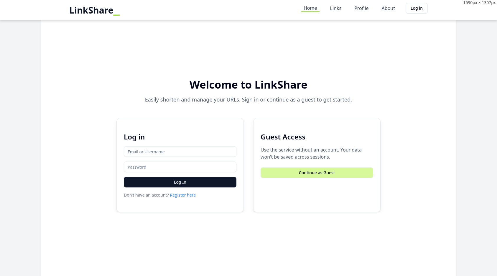
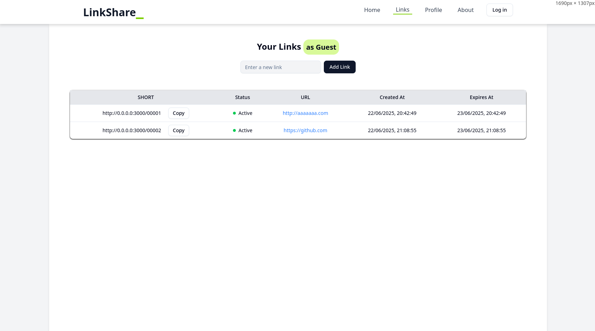
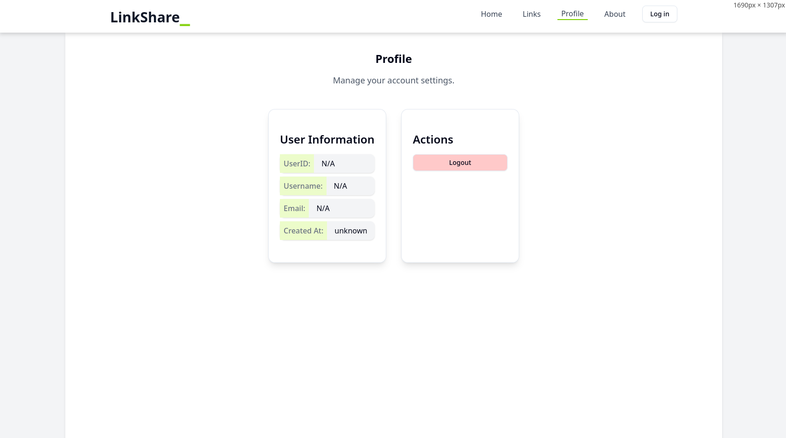
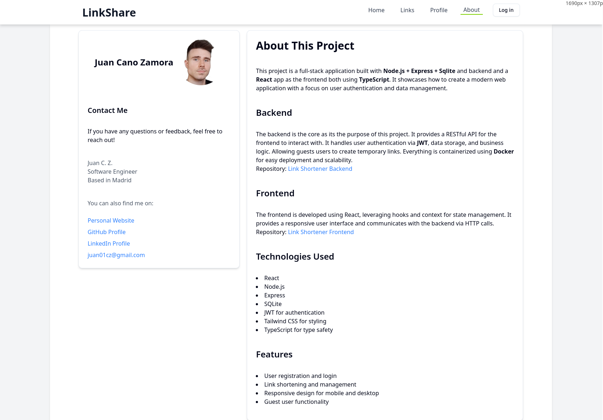

# Frontend for the bakcend API -> [backend repo](https://github.com/jucaza1/link_shortener_ts)
## Link Shortener Frontend
This is a minimalistic frontend for my link shortener backend API.
## Installation
1. Clone the repository:
   ```bash
   git clone https://github.com/jucaza1/link-frontend.git
    ```
2. Navigate to the project directory:
    ```bash
    cd link-frontend
    ```
3. Install the dependencies:
    ```bash
    npm install
    ```
4. Start the development server:
    ```bash
    npm start
    ```

## With Docker
1. Build the Docker image:
    ```bash
    docker build -t link-frontend .
    ```
2. Run the Docker container:
    ```bash
    docker run -p 80:5173 link-frontend
    ```
3. Open your browser and go to `http://localhost`.

## Usage
The frontend expects the backend API to be running on `http://0.0.0.0:3000`.
You can change the API URL in the `src/config.ts` file if needed.

## Screenshots






